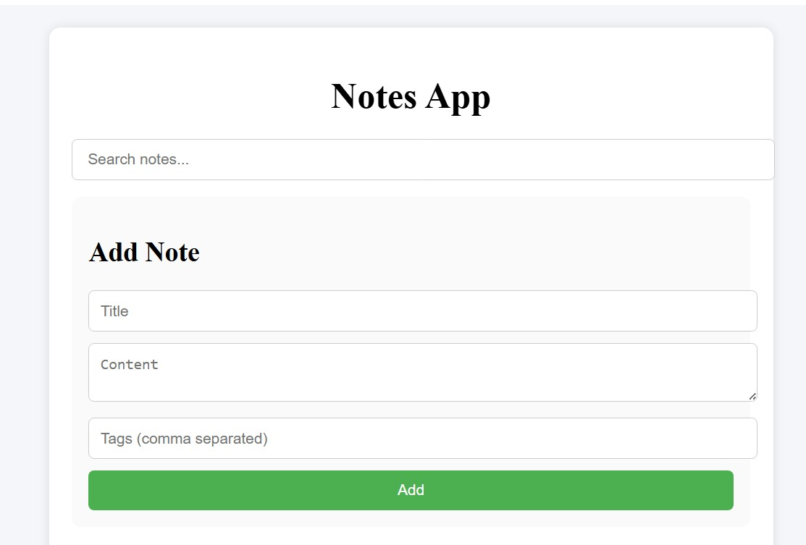
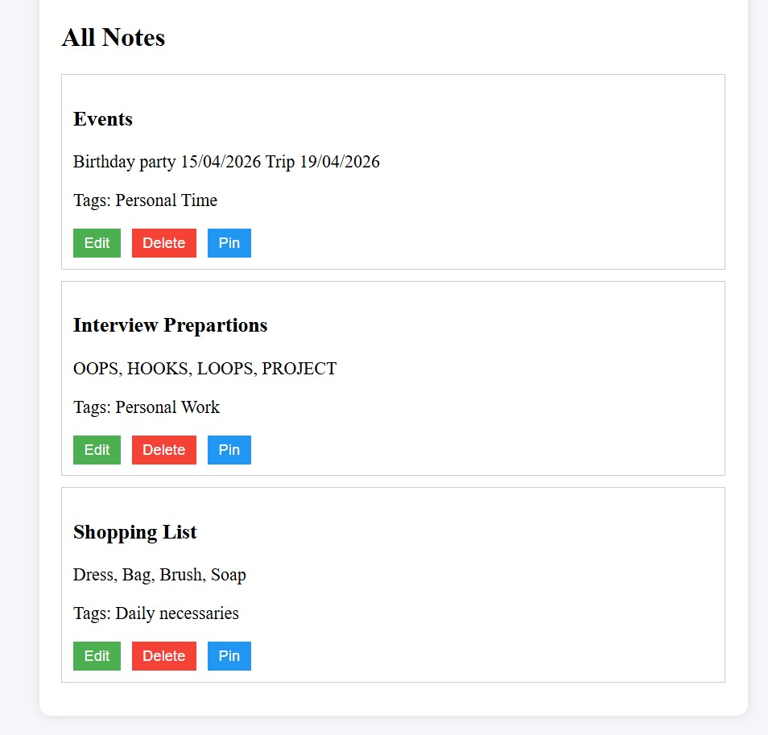
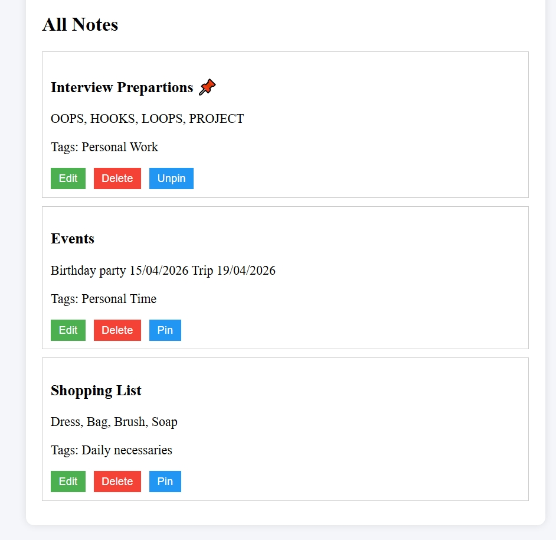

# 📝 Notes Management System

## 📌 Project Overview
This is a full-stack Notes Management System where users can create, update, delete, search, and manage notes efficiently.  
The application also includes bonus features like tags, pin notes, and auto-save for better user experience.

## 🚀 Features
- Add new notes  
- Edit existing notes  
- Delete notes  
- Search notes  
- Add tags to notes  
- Pin important notes 📌  
- Auto-save form data ✨  

## 🛠️ Tech Stack
- Frontend: React.js  
- Backend: Node.js + Express  
- Database: MongoDB  

## ⚙️ Setup Instructions

### 🔹 Backend Setup
1. Navigate to backend folder:
cd backend  

2. Install dependencies:
npm install  

3. Start server:
npm run dev  

### 🔹 Frontend Setup
1. Navigate to frontend folder:
cd frontend  

2. Install dependencies:
npm install  

3. Start React app:
npm start  

## 🌐 API Endpoints
- POST /api/notes → Create note  
- GET /api/notes → Get all notes  
- PUT /api/notes/:id → Update note  
- DELETE /api/notes/:id → Delete note  

## 📸 Screenshots
### 🏠 Home Page

### ➕ Create Note

### 🔍 Search Notes

### 📌 Pin Note

## 📂 Folder Structure
notes-management-system
├── backend
├── frontend
├── screenshots
└── README.md

## 👩‍💻 Author
Mansi Pokale